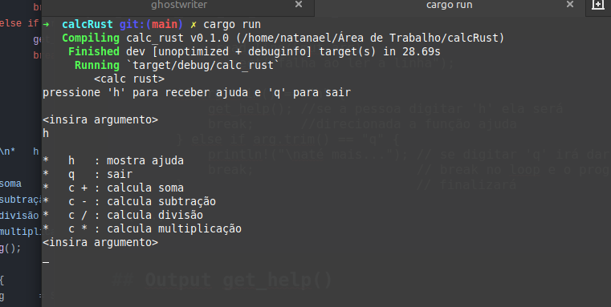

# Calculadora simples em Rust

Esse programa foi escrito em Rust como parte de exercício no meu início de estudos na linguagem. Aqui eu calcula as quatro operações básicas da matemática (Adição, Subtração, Divisão e Multiplicação).

## Chamada da função getting_arg() na função main()

Assim que inicializamos o código com a biblioteca ```std::io``` para obtermos a entrada do usuário e da usuária no programa nós informamos na função ```main``` com a macro ```println!``` as possibilidades introdutivas de comandos no programa. Veja:

```rust
use std::io

fn main() {
	println!("\t<calc rust>");
	println!("pressione 'h' para receber ajuda e 'q' para sair\n");
	getting_arg(); //chamada de função
}
	
```

## A função getting_arg()

A função ```getting_arg()``` introduz um looping com ifs testando  entrada do usuário e da usuária no programa. 

```rust
fn getting_arg() {
	loop {
		println!("<insira argumento>")
		let mut arg = String::new();
		
		io::stdin()
			.read_line(&mut arg)
			.expect("falha ao ler a linha");
			
		if arg.trim() == "h" {
			get_help(); //se a pessoa digitar 'h' ela será 
			break;      //direcionada a função ajuda
		} else if arg.trim() == "q" {
			println!("\naté mais..."); // se digitar 'q' irá dar
			break;                     // break no loop e o programa
		}							  // finalizará
		
//(...)
	
```

## Output get_help() 
Aqui podemos ver claramente como cada operação pode ser feita.



Após o comando digitado, seja 'c +' ou 'c -', escreva os números a cada linha dada enter, ou seja, digite 'c +', logo após isso, digite o número da sua escolha, aperte enter, digite outro número e enter e terá o resultado na tela.